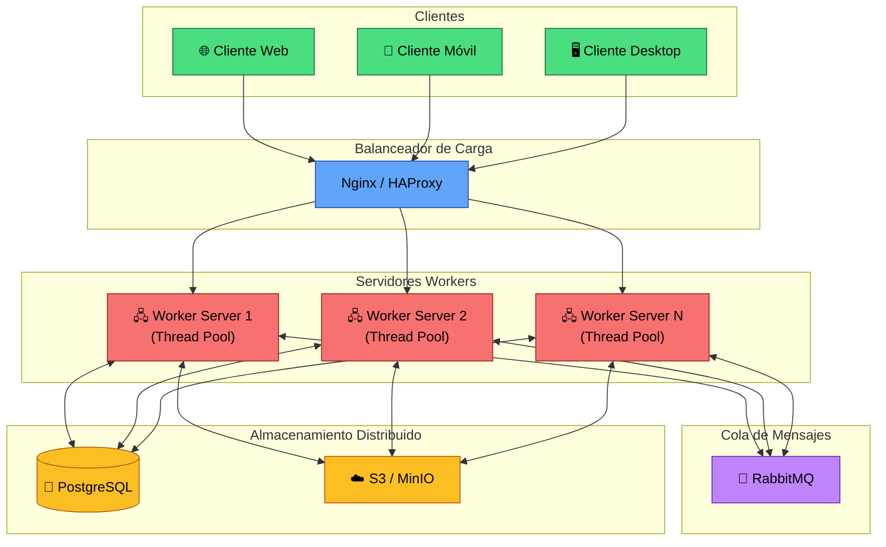

# Diagrama de Arquitectura - Sistema Distribuido Cliente-Servidor



## Explicación de cada capa

| Componente | Rol |
|---|---|
| **Clientes** (web, móvil, desktop) | Envían tareas al sistema vía HTTP o sockets |
| **Balanceador (Nginx / HAProxy)** | Distribuye las conexiones entrantes entre los servidores workers |
| **Worker Servers** | Cada servidor tiene un `ThreadPoolExecutor` con N hilos. Reciben la tarea, la procesan y devuelven el resultado |
| **RabbitMQ** | Cola de mensajes para comunicación asíncrona entre servidores (p. ej., redistribuir trabajo, notificaciones) |
| **PostgreSQL** | Base de datos relacional para guardar resultados y estado de las tareas |
| **S3 / MinIO** | Almacenamiento distribuido de objetos (archivos, imágenes, resultados pesados) |

## Flujo de una tarea

```
Cliente → Balanceador → Worker Server → Thread Pool → Resultado → Cliente
                                    ↕
                                 RabbitMQ
                                    ↕
                         PostgreSQL / S3 (persistencia)
```