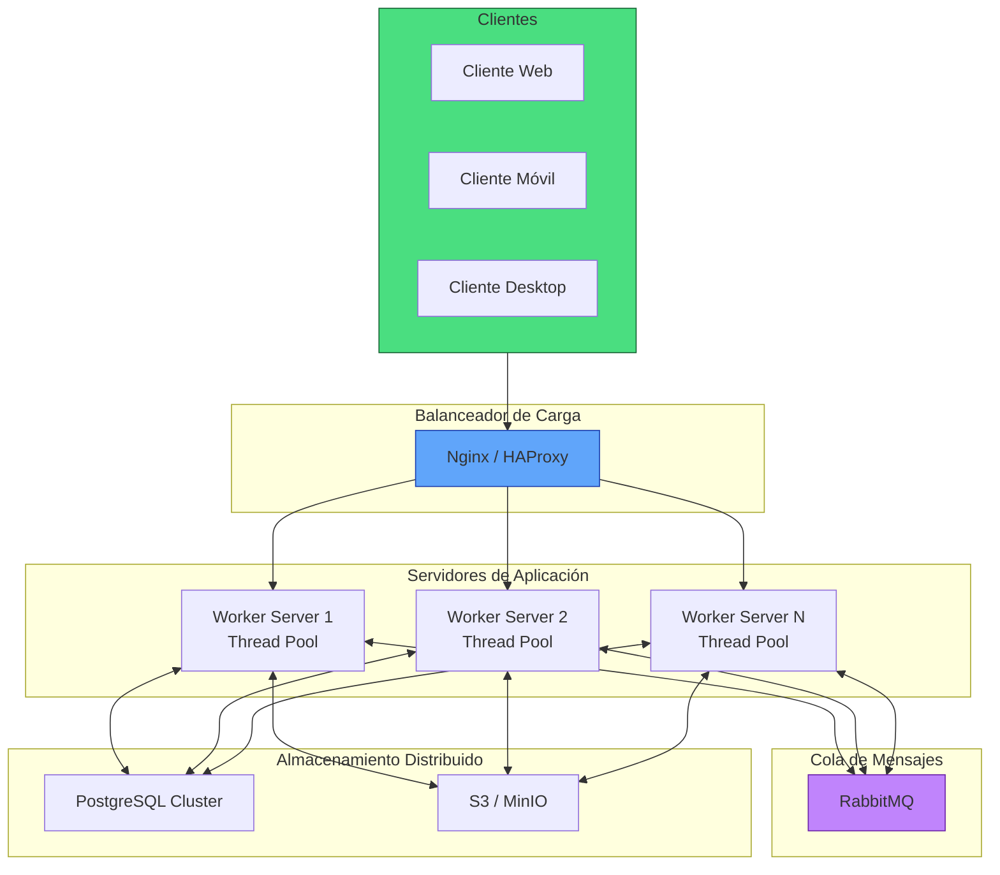

# Diagrama de Arquitectura - Sistema Distribuido Cliente-Servidor

## Explicación del Diagrama
- **Clientes**: Acceden a través de web/móvil.
- **Balanceador**: Distribuye conexiones entre servidores.
- **Workers**: Cada uno maneja un pool de hilos para procesar tareas concurrentemente.
- **RabbitMQ**: Para comunicación asíncrona entre servidores/workers.
- **Almacenamiento**: PostgreSQL para datos estructurados + S3 para archivos.